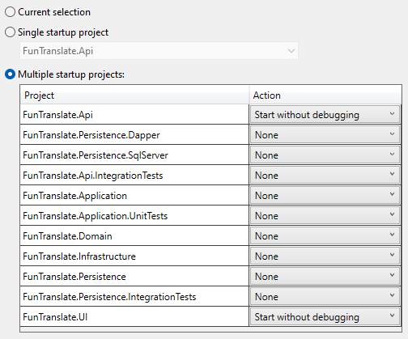

## FunTranslate

This repository is an approach to using principles of Clean Architecture and CQRS by implementing a custom wrapper API to use [Fun Translations API](https://funtranslations.com/) services.
We use Funtranslations API, which gives access to the complete set of translations available at [funtranslations.com](https://funtranslations.com/) so that you can integrate them into your workflow or an app.


## How it works

There is nothing special about the logic. When a user asks for a translation, it first checks the database to see if there is an available translation or not. If it founds the translation, then returns the result to the client. If not found, then asks from an external API (funtranslations.com). In case of a successful response, it saves the translation in the database for later usage. In the end, it returns the result to the client.


## Libraries & Technologies
- [ASP.NET Core 6](https://docs.microsoft.com/en-us/aspnet/core/introduction-to-aspnet-core?view=aspnetcore-6.0)
- [Entity Framework Core 6](https://docs.microsoft.com/en-us/ef/core/)
- [Dapper](https://github.com/DapperLib/Dapper)
- [MS SQL Server](https://www.microsoft.com/en-us/sql-server/sql-server-downloads)
- [MediatR](https://github.com/jbogard/MediatR)
- [AutoMapper](https://automapper.org/)
- [FluentValidation](https://fluentvalidation.net/)
- [xUnit](https://github.com/xunit/xunit) , [Moq](https://github.com/moq) , [Shouldly](https://github.com/shouldly/shouldly)

## Overview

### Domain

This will contain all entities, entity base classes, and shared classes related to entities.

### Application

This layer contains all application logic. It is dependent on the domain layer but has no dependencies on any other layer or project. This layer defines interfaces that are implemented by outside layers. For example, the application needs to access an external service [funtranslations.com](https://funtranslations.com/) , so an interface is added to the application, and implementation is created within the Infrastructure. It also contains all abstractions related to the persistence layer ([MS SQL Server](https://www.microsoft.com/en-us/sql-server/sql-server-downloads))

### Infrastructure

This layer contains classes for accessing external resources such as API, persistence, etc. These classes should be based on interfaces defined within the application layer.

### API
This layer is a RESTful API based on ASP.NET Core 6. This layer depends on both the Application and Infrastructure layers; however, the dependency on Infrastructure is only to support dependency injection. Therefore only *Program.cs* should reference Infrastructure.

### WebUI

This layer is a Web Application based on ASP.NET Core 6. This layer depends on API.

## Getting Started

There are two prerequisites to launch the project: ' Visual Studio` and `MS SQL Server Express` (default with VS). If you have it, then you are ready.

Use the following instructions to startup and run the project.

### Database:
1. Open the solution and restore packages
2. Select `FunTranslate.Api` as a Startup project and open package manager (View - Other Windows - Package Manager Console)
3. In the Package Manager Console, select [ `src\Infrastructure\FunTranslate.Persistence` ] as Default Project.
4. Execute `update-database` and wait for the process to complete.

Note: If there is a problem with the `connection string` related to MS SQL Server, you can change it from `appsettings.json` file in `FunTranslate.Api` project.

### Stored Procedure (Related to Dapper): 
After loading the project, there is an XML file (Publish Profile) In the `FunTranslate.Persistence.SqlServer` project (`FunTranslate.Persistence.SqlServer.publish.xml`). It is for publishing any SQL-related files like`StoredProcedures,` and we can configure ConnectionString, DataBase name (In case we are using a different configuration) and publish the files.
To publish: Right-click on the `FunTranslate.Persistence.SqlServer` project and choose `Publish` or open `FunTranslate.Persistence.SqlServer.publish.xml` by Visual Studio (Double Click on the file, and VS opens Publish DataBase Dialog) and then choose `Publish`.

### Start:

1. Right click on the solution and click `Set Startup Projects...` select `Multiple Startup Projects` and choose the following projects to run run
```
    - FunTranslate.Api
    - FunTranslate.UI
```

It should be something like this image:



